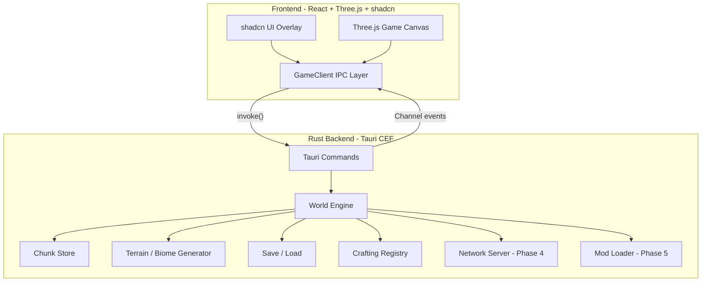
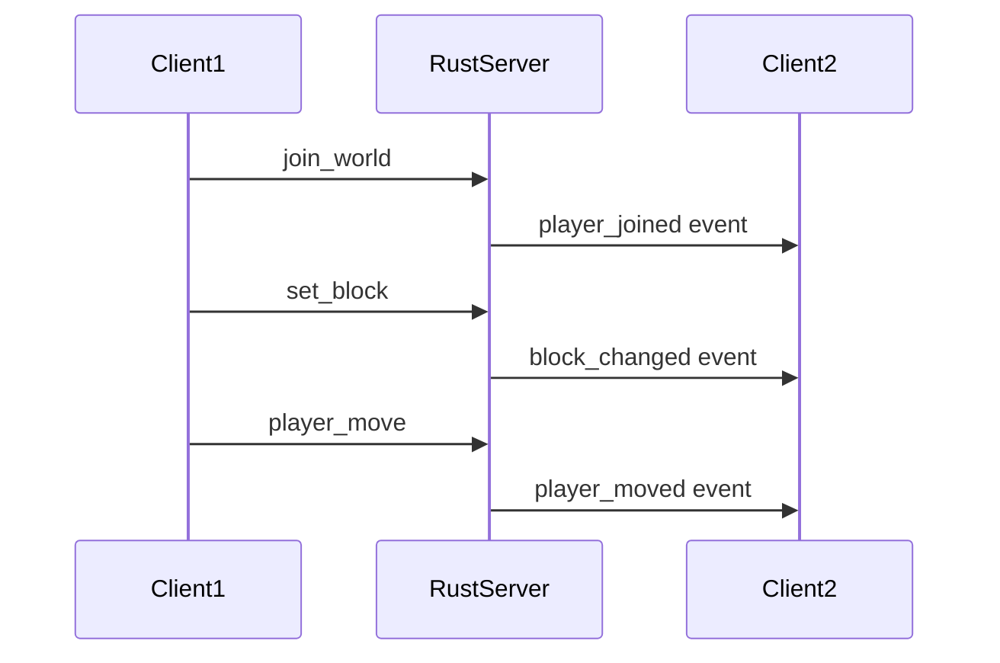

# Voxele: Minecraft Benzeri 3D Tauri Oyunu Dönüşüm Planı

## Mevcut Durum

Proje şu an minimal bir Tauri 2 iskeleti:

- Frontend: vanilla TS (`[src/main.ts](src/main.ts)`), greet demo
- Rust: tek komut `greet` (`[src-tauri/src/lib.rs](src-tauri/src/lib.rs)`)
- `three@0.184.0` ve `tailwindcss@4` kurulu ama kullanılmıyor
- shadcn yok, React yok

## Hedef Mimari




**Sorumluluk ayrımı:**

- **Rust**: dünya durumu, chunk verisi, prosedürel üretim, fizik kuralları, kayıt, ağ, mod API
- **TypeScript/Three.js**: render, kamera, input, UI, ses oynatma, client-side tahmin (prediction)
- **shadcn**: menüler, envanter, ayarlar, sohbet, crafting UI

---

## Faz 0 — Temel Altyapı (CEF + React + shadcn)

### 0.1 Resmi Tauri CEF (`feat/cef`) Entegrasyonu

Context7 ve resmi dal araştırmasına göre Linux/Arch için **resmi `feat/cef`** yolu doğru seçim. `wry` ve `cef` feature'ları birlikte açılamaz.

`[src-tauri/Cargo.toml](src-tauri/Cargo.toml)` değişiklikleri:

```toml
[dependencies]
tauri = { git = "https://github.com/tauri-apps/tauri", branch = "feat/cef", default-features = false, features = [
  "cef", "compression", "common-controls-v6", "dynamic-acl", "devtools"
] }

[build-dependencies]
tauri-build = { git = "https://github.com/tauri-apps/tauri", branch = "feat/cef" }
```

`[src-tauri/src/main.rs](src-tauri/src/main.rs)`:

```rust
#[cfg_attr(feature = "cef", tauri::cef_entry_point)]
fn main() {
    voxele_app_lib::run()
}
```

**Sistem bağımlılıkları (Arch Linux):**

- `cmake`, `ninja` — CEF `libcef_dll_wrapper` derlemesi için
- CEF binary önbelleği: `export-cef-dir` ile `~/.local/share/cef`
- `CEF_PATH` ve `LD_LIBRARY_PATH` env değişkenleri
- `tauri-cli` de `feat/cef` dalından kurulmalı:
`cargo install tauri-cli --git https://github.com/tauri-apps/tauri --branch feat/cef --locked`

**Bilinen riskler:**

- Deneysel dal; production-ready değil
- İlk build 3–10 dk (CEF indirme + CMake)
- Bundle boyutu ~100MB (CEF)
- `AppHandle` generic tipi değişebilir (`R: Runtime` gerekebilir)

### 0.2 Frontend: Vanilla TS → React + Vite

shadcn React gerektirir. Mevcut vanilla yapı React'e taşınacak:

```bash
pnpm add react react-dom
pnpm add -D @vitejs/plugin-react @types/react @types/react-dom
```

- `[vite.config.ts](vite.config.ts)`: `@vitejs/plugin-react` + mevcut `@tailwindcss/vite`
- Yeni giriş: `src/main.tsx`, `src/App.tsx`
- Three.js canvas React dışında veya `useRef` ile yönetilecek (performans için canvas DOM'u React reconciliation dışında tutulmalı)

### 0.3 shadcn/ui Kurulumu

```bash
pnpm dlx shadcn@latest init --preset <vite-react-preset>
```

Tailwind v4 zaten kurulu; shadcn `info` çıktısındaki `tailwindCssFile` ve alias'lara uyulacak.

İlk eklenecek bileşenler:

- `button`, `dialog`, `sheet`, `tabs`, `tooltip`, `badge`, `progress`, `separator`
- Oyun UI'si için custom: `Hotbar`, `BlockPicker`, `InventoryGrid`, `ChatPanel`

**shadcn kuralları:** `FieldGroup`/`Field` formlar, `gap-`* spacing, semantic renkler, `DialogTitle` zorunluluğu.

### 0.4 Proje Dizin Yapısı

```
src/
├── main.tsx
├── App.tsx
├── game/
│   ├── GameEngine.ts        # Three.js scene, loop, resize
│   ├── ChunkMeshBuilder.ts  # Face-culled chunk mesh
│   ├── PlayerController.ts  # FirstPersonControls + input
│   ├── BlockRaycaster.ts    # Break/place raycast
│   ├── TextureAtlas.ts      # Block texture atlas loader
│   └── types.ts             # BlockId, ChunkPos, Vec3
├── ipc/
│   └── gameClient.ts        # invoke wrappers + event listeners
├── ui/
│   ├── GameHUD.tsx          # Hotbar, crosshair, debug info
│   ├── MainMenu.tsx         # New world / Load / Settings
│   ├── Inventory.tsx
│   ├── CraftingTable.tsx
│   └── SettingsDialog.tsx
└── lib/utils.ts             # cn() helper (shadcn)

src-tauri/src/
├── lib.rs                   # App builder, plugin registration
├── commands/
│   ├── mod.rs
│   ├── world.rs             # get_chunk, set_block, get_block
│   ├── player.rs            # position, inventory
│   └── save.rs              # save_world, load_world
├── world/
│   ├── mod.rs
│   ├── chunk.rs             # 16x16x256 chunk storage
│   ├── block.rs             # Block registry + properties
│   └── coordinates.rs
├── generation/
│   ├── mod.rs
│   ├── noise.rs             # Perlin/Simplex terrain
│   └── biomes.rs            # Biome map (Phase 2)
├── persistence/
│   └── mod.rs               # RON/bincode world save
└── network/                 # Phase 4
    └── mod.rs
```

---

## Faz 1 — Çekirdek Voxel Motoru (Tek Oyunculu MVP)

Three.js resmi örneklerinden (`[webgl_geometry_minecraft](https://github.com/mrdoob/three.js/blob/dev/examples/webgl_geometry_minecraft.html)`, `[voxel-geometry-culled-faces](https://github.com/mrdoob/three.js/blob/dev/manual/examples/voxel-geometry-culled-faces.html)`) esinlenilecek.

### 1.1 Rust: Dünya ve Chunk Sistemi

**Chunk boyutu:** 16×256×16 (Minecraft standardına yakın)

```rust
// src-tauri/src/world/chunk.rs
pub struct Chunk {
    blocks: [BlockId; CHUNK_VOLUME],
    pub pos: ChunkPos,
    dirty: bool,
}
```

**Tauri komutları (IPC sözleşmesi):**


| Komut              | Yön     | Açıklama                               |
| ------------------ | ------- | -------------------------------------- |
| `get_chunk`        | TS→Rust | ChunkPos → sıkıştırılmış block array   |
| `set_block`        | TS→Rust | WorldPos + BlockId → bool              |
| `get_block`        | TS→Rust | WorldPos → BlockId                     |
| `generate_world`   | TS→Rust | seed + boyut → başlangıç chunk listesi |
| `get_player_state` | TS→Rust | pozisyon, yaw, pitch                   |
| `set_player_state` | TS→Rust | hareket güncelleme                     |


Chunk verisi `Uint8Array` veya `Vec<u8>` olarak serialize edilip frontend'e gönderilecek (JSON-RPC overhead'i minimize etmek için base64 veya raw bytes).

### 1.2 Three.js: Chunk Renderer

- **Face culling**: komşu blok doluysa yüz render etme (Three.js `VoxelWorld` pattern)
- **Chunk meshing**: her chunk için `BufferGeometry` + `MeshLambertMaterial` + texture atlas
- **Lazy loading**: oyuncu etrafındaki chunk'ları Rust'tan iste, mesh oluştur, sahneye ekle
- **Chunk unload**: mesafe eşiğini aşan chunk'ları dispose et

```typescript
// src/game/ChunkMeshBuilder.ts - temel pattern
const { positions, normals, uvs, indices } = buildChunkMesh(blocks, neighbors);
geometry.setAttribute('position', new Float32Array(positions));
// ...
```

### 1.3 Birinci Şahıs Kontrol

Three.js `FirstPersonControls` (addons):

- WASD hareket, mouse look
- Pointer Lock API (canvas'a tıklayınca)
- Yerçekimi + zemin collision (Rust'ta basit AABB veya TS'te raycast-down)
- Blok kırma/yerleştirme: `BlockRaycaster` + Shift=remove, click=place

### 1.4 shadcn Oyun HUD

- **Hotbar**: 9 slot, seçili blok vurgusu (`ToggleGroup` veya custom grid)
- **Crosshair**: CSS overlay (canvas üstünde)
- **Debug panel**: FPS, chunk sayısı, koordinat (`Badge` + monospace)
- **Pause menu**: `Dialog` ile devam/ayarlar/çıkış

### 1.5 Pencere Ayarları

`[src-tauri/tauri.conf.json](src-tauri/tauri.conf.json)`:

- Tam ekran oyun: 1280×720 başlangıç, `fullscreen: false`, `decorations: true`
- `cursor: none` oyun modunda (Pointer Lock ile)
- CSP: WebGL için `null` kalabilir (mevcut)

---

## Faz 2 — Dünya Sistemleri

### 2.1 Biyomlar ve Prosedürel Üretim (Rust)

- **Noise stack**: `noise` crate veya custom Perlin (octaves, persistence)
- **Biome map**: sıcaklık + nem → biome ID (düz, orman, çöl, dağ, okyanus)
- **Block palette per biome**: biome'a göre yüzey/toprak/blok türü
- **Yapılar**: ağaç, mağara (basit cellular automata veya worm carving)

### 2.2 Gündüz/Gece Döngüsü

- Rust: `world_time` state (0–24000 tick)
- TS: `DirectionalLight` intensity/color + sky gradient shader
- shadcn: saat göstergesi (opsiyonel)

### 2.3 Kayıt / Yükleme

- Format: `world.json` (meta) + `chunks/` dizini (chunk dosyaları)
- Rust: `save_world`, `load_world`, `list_worlds` komutları
- shadcn: `MainMenu` → dünya listesi (`Card` + `Button`)

---

## Faz 3 — Oyun Mekaniği

### 3.1 Envanter Sistemi

- Rust: `PlayerInventory` struct (36 slot + hotbar 9 slot)
- IPC: `move_item`, `drop_item`, `pickup_item`
- shadcn: `Inventory` grid UI (sürükle-bırak veya tıkla-taşı)

### 3.2 Crafting

- Rust: `RecipeRegistry` (2×2 el crafting + 3×3 masa)
- Pattern matching: grid layout → output item
- shadcn: `CraftingTable` UI (3×3 grid + sonuç slot)

### 3.3 Blok Özellikleri

- `BlockRegistry`: hardness, tool requirement, drops, transparent/solid
- Kırma süresi, drop item spawn

### 3.4 Ses

- TS: `three/addons/audio/AudioListener` + block break/place/step sounds
- Asset pipeline: `public/sounds/`

---

## Faz 4 — Çok Oyunculu




- **Rust**: `tokio` + `tokio-tungstenite` veya `quinn` (UDP) ile dedicated server modu
- **Tauri Channel API**: gerçek zamanlı event stream (Context7: `Channel<DownloadEvent>` pattern)
- **Client prediction**: hareket lokal, sunucu authoritative correction
- **Chunk sync**: sadece değişen chunk delta'ları gönder
- shadcn: `ChatPanel`, oyuncu listesi

---

## Faz 5 — Mod Desteği

- **Rust mod API**: `BlockDef`, `BiomeDef`, `RecipeDef` trait'leri + `libloading` ile `.so`/`.dll` yükleme
- **TS mod API**: custom block renderer hook, UI extension points
- **Mod manifest**: `mod.toml` (id, version, dependencies)
- Mod dizini: `~/.voxele/mods/`

---

## IPC Tasarım Prensipleri

Context7 Tauri IPC dokümantasyonuna göre:

1. **Komutlar** (`invoke`): request/response, JSON-serializable tipler
2. **Channel**: sıralı stream (chunk generation progress, multiplayer events)
3. **Events** (`emit`/`listen`): fire-and-forget bildirimler

```typescript
// src/ipc/gameClient.ts
import { invoke, Channel } from '@tauri-apps/api/core';

export async function getChunk(pos: ChunkPos): Promise<Uint8Array> {
  return invoke('get_chunk', { x: pos.x, z: pos.z });
}

export async function onBlockChanged(handler: (e: BlockChangeEvent) => void) {
  // Phase 4: Channel or listen('block-changed')
}
```

**Performans:** Chunk verisi büyük olduğundan Faz 1'den itibaren binary transfer (`Uint8Array`) tercih edilmeli; JSON block-by-block gönderimi ölçeklenmez.

---

## Bağımlılık Özeti


| Paket                         | Amaç                  | Faz |
| ----------------------------- | --------------------- | --- |
| `react`, `react-dom`          | UI framework (shadcn) | 0   |
| shadcn components             | Oyun menüleri/HUD     | 0   |
| `three` (dependencies'e taşı) | 3D render             | 1   |
| `@types/three`                | TS tipleri            | 1   |
| `noise` (Rust crate)          | Terrain generation    | 2   |
| `bincode` veya `serde_json`   | Save format           | 2   |
| `tokio`, `tokio-tungstenite`  | Multiplayer           | 4   |
| `libloading`                  | Mod loader            | 5   |


---

## Geliştirme Sırası (Önerilen)

1. **Faz 0** tamamlanmadan oyun kodu yazılmamalı — CEF build doğrulanmalı
2. **Faz 1** ile oynanabilir tek oyunculu prototip (1–2 hafta)
3. **Faz 2–3** gameplay depth (2–4 hafta)
4. **Faz 4–5** uzun vadeli; modüler mimari Faz 1'den itibaren buna göre tasarlanmalı

## Doğrulama Kontrol Listesi

- [ ] `cargo tauri dev` CEF ile başlıyor, User-Agent'ta Chrome görünüyor
- [ ] `invoke('get_chunk')` chunk verisi döndürüyor
- [ ] Three.js sahnesinde prosedürel terrain render ediliyor
- [ ] WASD + mouse ile hareket, blok kır/yerleştir çalışıyor
- [ ] shadcn hotbar ve pause menu görünüyor
- [ ] Dünya kaydedilip yüklenebiliyor (Faz 2)
- [ ] İki client aynı dünyada senkronize (Faz 4)